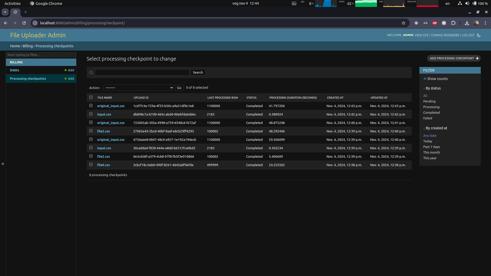
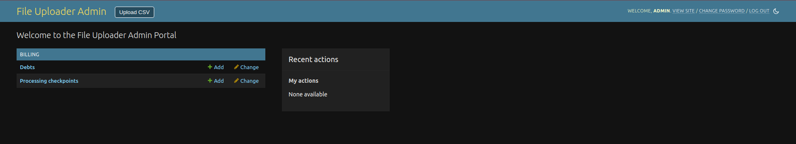
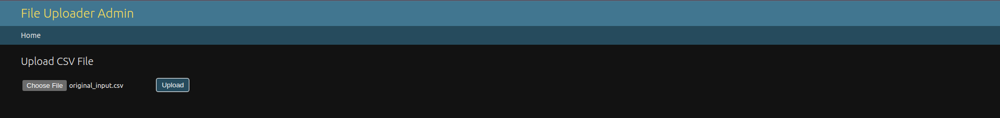
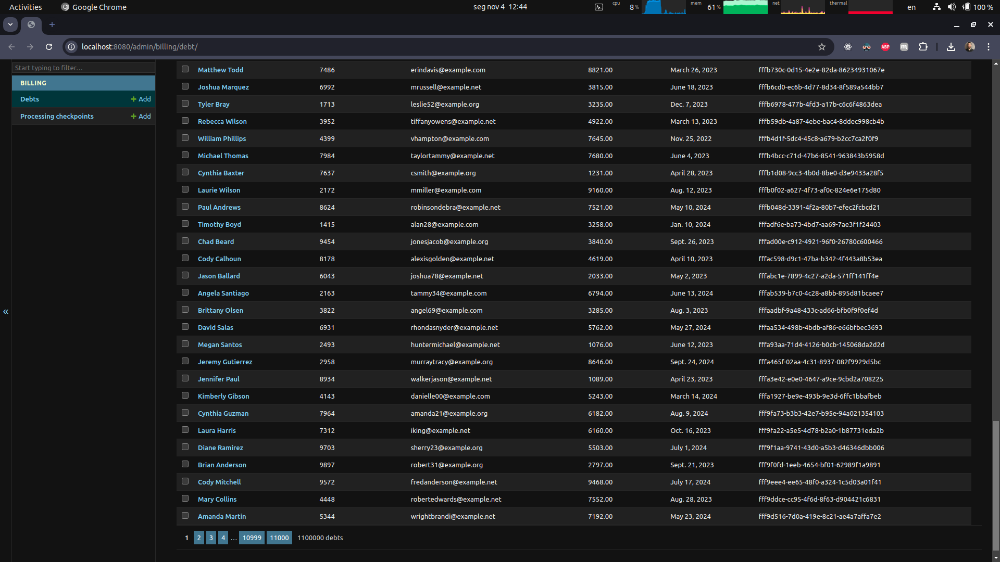
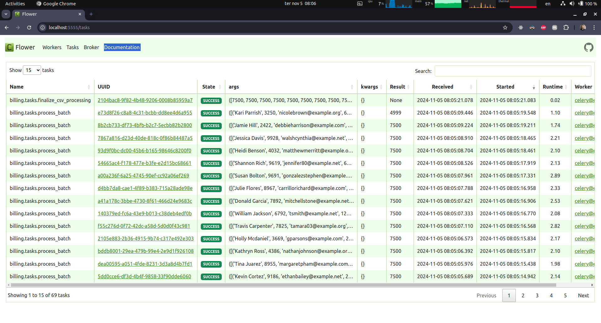
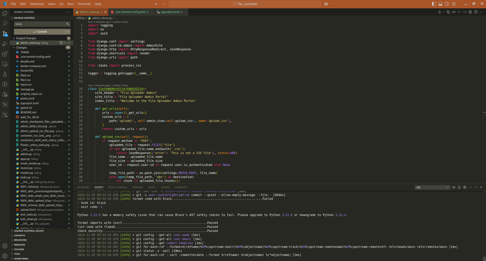
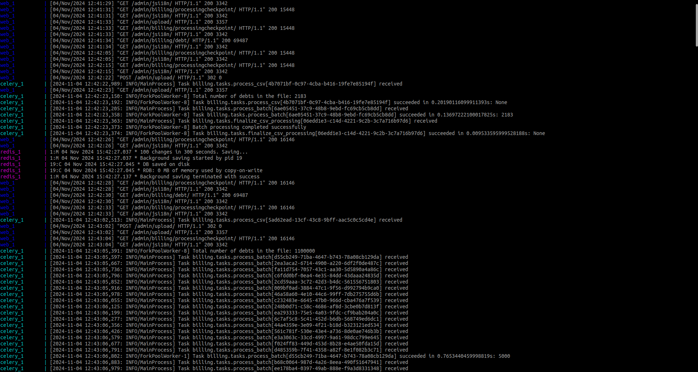
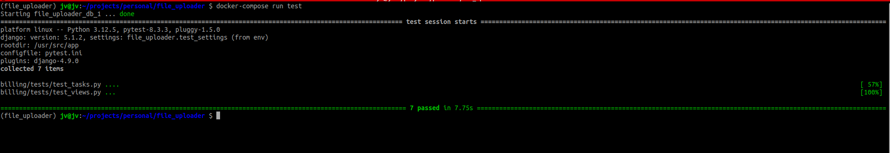

# 📁 File Uploader

A robust system designed to handle file uploads, process them asynchronously, and manage data efficiently.

---

## 💻 About

The **File Uploader** system allows users to upload .csv files, which are then processed in the background. The system ensures that large files are handled efficiently without blocking the main application thread. Users can monitor the status of their uploads and view processed data through intuitive interfaces.

You can interact with the system using [Django Admin](http://localhost:8080/admin/)

### Key Features:

- **Asynchronous Processing:** Utilizes Celery and Redis to handle file processing tasks in the background.
- **Dockerized Environment:** Fully containerized using Docker and Docker Compose for easy setup and deployment.
- **Database Management:** Employs PostgreSQL for reliable data storage and DuckDB for efficient data querying.
- **Code Quality:** Maintains high code quality with tools like Black, Flake8, and Bandit.
- **Testing:** Comprehensive testing suite using Pytest and Pytest-Django.

---

## 🥞 Stack

- [Python v3.12](https://www.python.org/doc/)
- [Django v5.1.2](https://docs.djangoproject.com/en/5.1/)
- [Django REST Framework v3.15](https://www.django-rest-framework.org/community/release-notes/#315x-series)
- [Celery v5.4.0](https://docs.celeryq.dev/en/stable/)
- [Redis v5.2.0](https://redis.io/documentation)
- [Flower v2.0.1](https://flower.readthedocs.io/en/latest/)
- [DuckDB v1.1.2](https://duckdb.org/)
- [PostgreSQL](https://www.postgresql.org/)
- [Psycopg2 v2.9.10](https://www.psycopg.org/docs/)

---

## ⚙️ Setting Up the Project

### ⚠️ Requirements

To run the project locally, you need to have [Docker](https://docs.docker.com/engine/install/) and [Docker Compose](https://docs.docker.com/compose/install/) installed on your machine.

---

## 🆙 Running the Project

### 1. Clone the Repository

#### HTTPS

```bash
git clone https://github.com/jvictor-am/file_uploader.git
```

#### SSH

```bash
git clone git@github.com:jvictor-am/file_uploader.git
```

### 2. Navigate to the Project Directory

```bash
cd file_uploader
```

### 3. Create .env file based on [.env.example](/.env.example)

### 4. Build and Run the Containers

```bash
docker-compose up --build
```
or
```bash
docker-compose up -d --build
```

### 5. Clean Up Containers

If you need to stop the containers and remove the associated volumes, run:

```bash
docker-compose down --volumes --remove-orphans
```

### 6. To enable code quality locally and pre-commit...


```bash
docker exec file_uploader_web_1 sh -c "git config --global --add safe.directory /usr/src/app && pre-commit install"
```

### 7. Accessing the Application

- **Django Admin:** [http://localhost:8080/admin](http://localhost:8080/admin)\
  Use the credentials created with create_superuser.py.

### 8. Running Tests

Execute the test suite using Pytest:

```bash
docker-compose run test
```
---

### 🛠️ Development Tools

- **Black:** Automatic code formatting.
- **Flake8:** Code linting for style and quality assurance.
- **Isort:** Automatic import sorting.
- **Bandit:** Security linting to identify potential vulnerabilities.
- **Pre-commit Hooks:** Enforce code standards before commits.
- **Pytest & Pytest-Django:** Comprehensive testing framework for reliability.

---

## Images

<h3 align="center">
  


<details><summary><b>More Images</b></summary>
  








</details>
</h3>